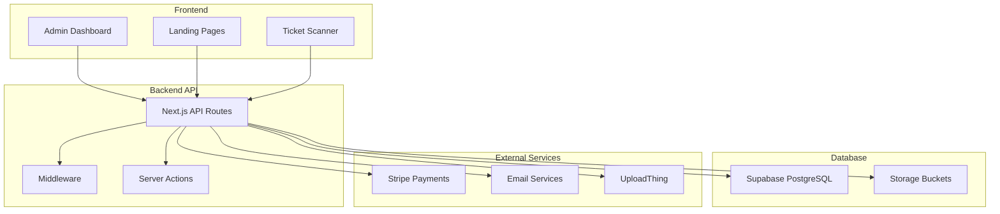
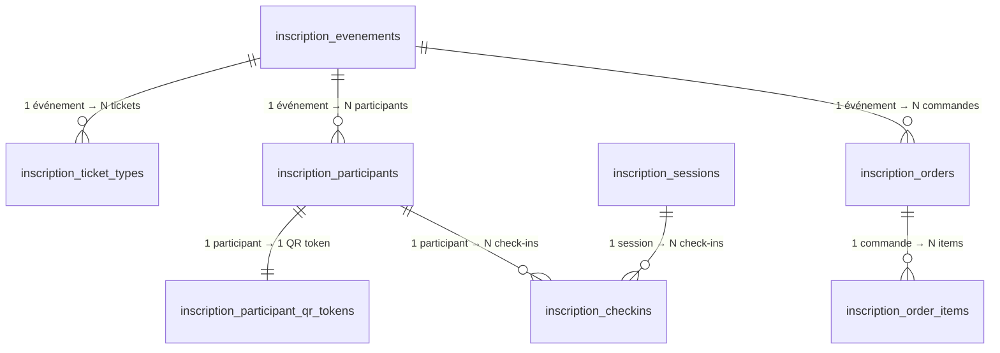
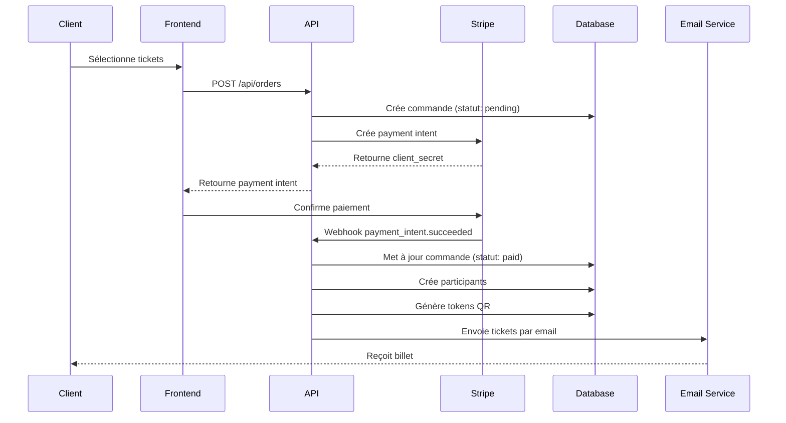
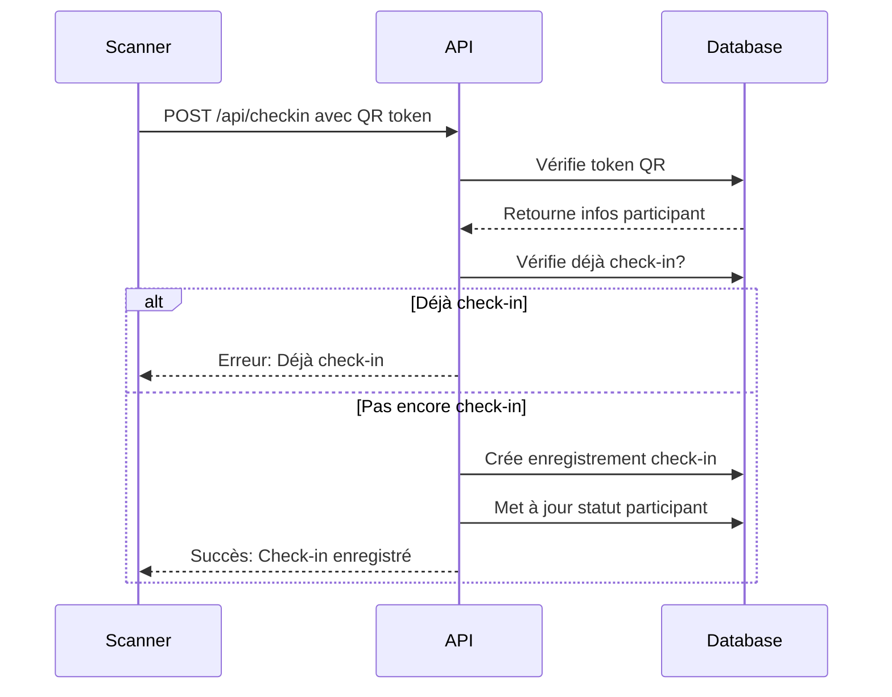

# 🏗️ Architecture Technique Détaillée

> **Structure complète du système de gestion des tickets et interactions entre les composants**

## 📋 Table des Matières

1. [Vue d'ensemble de l'architecture](#-vue-densemble-de-larchitecture)
2. [Base de données](#-base-de-données)
3. [Frontend](#-frontend)
4. [Backend API](#-backend-api)
5. [Services externes](#-services-externes)
6. [Flux de données](#-flux-de-données)
7. [Sécurité](#-sécurité)

## 🌐 Vue d'ensemble de l'architecture



## 🗄️ Base de données

### Structure des tables principales

```sql
-- Événements
CREATE TABLE inscription_evenements (
    id UUID PRIMARY KEY DEFAULT gen_random_uuid(),
    nom TEXT NOT NULL,
    description TEXT,
    lieu TEXT,
    date_debut TIMESTAMPTZ NOT NULL,
    date_fin TIMESTAMPTZ NOT NULL,
    prix NUMERIC,
    places_disponibles INTEGER,
    evenement_payant BOOLEAN DEFAULT false,
    statut TEXT DEFAULT 'brouillon', -- brouillon, publié, archivé
    created_at TIMESTAMPTZ DEFAULT NOW()
);

-- Types de tickets
CREATE TABLE inscription_ticket_types (
    id UUID PRIMARY KEY DEFAULT gen_random_uuid(),
    evenement_id UUID REFERENCES inscription_evenements(id) ON DELETE CASCADE,
    nom TEXT NOT NULL,
    description TEXT,
    prix NUMERIC NOT NULL,
    type_tarif TEXT, -- early, regular, late, vip
    date_debut_vente DATE,
    date_fin_vente DATE,
    quota_total INTEGER,
    billets_vendus INTEGER DEFAULT 0,
    visible BOOLEAN DEFAULT true,
    created_at TIMESTAMPTZ DEFAULT NOW()
);

-- Commandes
CREATE TABLE inscription_orders (
    id UUID PRIMARY KEY DEFAULT gen_random_uuid(),
    order_number TEXT UNIQUE NOT NULL,
    evenement_id UUID REFERENCES inscription_evenements(id) ON DELETE CASCADE,
    acheteur_email TEXT NOT NULL,
    acheteur_nom TEXT NOT NULL,
    montant_total NUMERIC NOT NULL,
    statut TEXT DEFAULT 'pending', -- pending, paid, cancelled, refunded
    created_at TIMESTAMPTZ DEFAULT NOW()
);

-- Participants
CREATE TABLE inscription_participants (
    id SERIAL PRIMARY KEY,
    evenement_id UUID REFERENCES inscription_evenements(id) ON DELETE CASCADE,
    nom TEXT NOT NULL,
    prenom TEXT NOT NULL,
    email TEXT NOT NULL,
    telephone TEXT NOT NULL,
    checked_in BOOLEAN DEFAULT false,
    checked_in_at TIMESTAMPTZ,
    ticket_sent BOOLEAN DEFAULT false,
    ticket_sent_at TIMESTAMPTZ,
    token_landing_page TEXT UNIQUE,
    created_at TIMESTAMPTZ DEFAULT NOW()
);

-- Tokens QR
CREATE TABLE inscription_participant_qr_tokens (
    id SERIAL PRIMARY KEY,
    participant_id INTEGER REFERENCES inscription_participants(id) ON DELETE CASCADE,
    evenement_id UUID REFERENCES inscription_evenements(id) ON DELETE CASCADE,
    qr_token TEXT UNIQUE NOT NULL,
    ticket_url TEXT NOT NULL,
    created_at TIMESTAMPTZ DEFAULT NOW(),
    expires_at TIMESTAMPTZ,
    is_active BOOLEAN DEFAULT true
);

-- Check-ins
CREATE TABLE inscription_checkins (
    id SERIAL PRIMARY KEY,
    participant_id INTEGER REFERENCES inscription_participants(id) ON DELETE CASCADE,
    evenement_id UUID REFERENCES inscription_evenements(id) ON DELETE CASCADE,
    session_id INTEGER REFERENCES inscription_sessions(id) ON DELETE CASCADE,
    checked_in_at TIMESTAMPTZ DEFAULT NOW(),
    checked_by TEXT,
    qr_token TEXT,
    device_info JSONB,
    notes TEXT,
    UNIQUE(participant_id, session_id)
);

-- Templates de tickets
CREATE TABLE inscription_ticket_templates (
    id SERIAL PRIMARY KEY,
    evenement_id UUID REFERENCES inscription_evenements(id) ON DELETE CASCADE,
    template_type TEXT NOT NULL, -- a4, thermal, mobile
    orientation TEXT DEFAULT 'portrait', -- portrait, landscape
    schema JSONB NOT NULL,
    created_at TIMESTAMPTZ DEFAULT NOW(),
    UNIQUE(evenement_id)
);
```

### Relations et contraintes



## 🎨 Frontend Architecture

### Structure des composants

```
src/
├── components/
│   ├── admin/
│   │   ├── EventForm.tsx
│   │   ├── ParticipantList.tsx
│   │   ├── TicketManager.tsx
│   │   └── CheckinDashboard.tsx
│   ├── tickets/
│   │   ├── TicketTemplate.tsx
│   │   ├── TicketViewer.tsx
│   │   ├── QrCodeCard.tsx
│   │   └── TicketPDFGenerator.tsx
│   ├── landing-templates/
│   │   ├── ModernGradientTemplate.tsx
│   │   ├── ClassicBusinessTemplate.tsx
│   │   └── [10 other templates...]
│   └── ui/
│       ├── Button.tsx
│       ├── Modal.tsx
│       ├── Form.tsx
│       └── [other base components...]
├── app/
│   ├── admin/
│   │   ├── evenements/
│   │   ├── participants/
│   │   └── dashboard/
│   ├── landing/
│   │   └── [eventId]/
│   ├── ticket/
│   │   └── [participantId]/
│   └── api/
│       ├── events/
│       ├── orders/
│       ├── payments/
│       └── checkin/
└── lib/
    ├── supabase/
    │   ├── client.ts
    │   ├── server.ts
    │   └── middleware.ts
    ├── stripe/
    │   ├── client.ts
    │   ├── webhooks.ts
    │   └── payments.ts
    └── email/
        ├── brevo.ts
        └── mailersend.ts
```

### État et gestion des données

```typescript
// src/types/index.ts
export interface Event {
  id: string;
  nom: string;
  description: string;
  date_debut: string;
  date_fin: string;
  lieu: string;
  evenement_payant: boolean;
  statut: 'brouillon' | 'publié' | 'archivé';
}

export interface TicketType {
  id: string;
  evenement_id: string;
  nom: string;
  prix: number;
  type_tarif: 'early' | 'regular' | 'late' | 'vip';
  quota_total?: number;
  billets_vendus: number;
}

export interface Order {
  id: string;
  order_number: string;
  evenement_id: string;
  acheteur_email: string;
  montant_total: number;
  statut: 'pending' | 'paid' | 'cancelled' | 'refunded';
}

export interface Participant {
  id: number;
  evenement_id: string;
  nom: string;
  prenom: string;
  email: string;
  telephone: string;
  checked_in: boolean;
  qr_token?: string;
}
```

## 🔧 Backend API

### Structure des routes API

```
app/api/
├── events/
│   ├── [eventId]/
│   │   ├── route.ts - GET/PUT/DELETE événement
│   │   ├── ticket-types/
│   │   │   └── route.ts - CRUD types de tickets
│   │   └── participants/
│   │       └── route.ts - CRUD participants
├── orders/
│   ├── route.ts - POST créer commande
│   ├── [orderId]/
│   │   └── route.ts - GET détails commande
├── payments/
│   ├── stripe/
│   │   └── route.ts - POST webhook Stripe
│   └── create-intent/
│       └── route.ts - POST créer payment intent
├── checkin/
│   ├── route.ts - POST effectuer check-in
│   └── verify-qr/
│       └── [token]/
│           └── route.ts - POST vérifier QR
├── tickets/
│   ├── generate/
│   │   └── route.ts - POST générer tickets PDF
│   └── templates/
│       └── route.ts - CRUD templates
└── emails/
    ├── send-ticket/
    │   └── route.ts - POST envoyer ticket
    └── templates/
        └── route.ts - GET templates email
```

### Middleware d'authentification

```typescript
// src/middleware.ts
import { createMiddlewareClient } from '@supabase/auth-helpers-nextjs';
import { NextResponse } from 'next/server';

export async function middleware(req) {
  const res = NextResponse.next();
  const supabase = createMiddlewareClient({ req, res });

  const {
    data: { session },
  } = await supabase.auth.getSession();

  // Routes protégées
  const protectedRoutes = ['/dashboard', '/admin', '/scanner', '/qr-scanner'];
  const isProtectedRoute = protectedRoutes.some(route =>
    req.nextUrl.pathname.startsWith(route)
  );

  if (isProtectedRoute && !session) {
    return NextResponse.redirect(new URL('/login', req.url));
  }

  // Ajouter le pathname au header pour les layouts
  res.headers.set('x-pathname', req.nextUrl.pathname);

  return res;
}
```

## 🔌 Services externes

### Integration Stripe

```typescript
// src/lib/stripe/client.ts
import Stripe from 'stripe';

const stripe = new Stripe(process.env.STRIPE_SECRET_KEY, {
  apiVersion: '2023-10-16',
});

export const createPaymentIntent = async (amount: number, orderId: string) => {
  return await stripe.paymentIntents.create({
    amount: amount * 100, // Convertir en centimes
    currency: 'eur',
    metadata: {
      orderId,
    },
  });
};

export const confirmPayment = async (paymentIntentId: string) => {
  return await stripe.paymentIntents.retrieve(paymentIntentId);
};
```

### Services email

```typescript
// src/lib/email/brevo.ts
import SibApiV3Sdk from 'sib-api-v3-sdk';

const client = SibApiV3Sdk.ApiClient.instance;
client.authentications['api-key'].apiKey = process.env.BREVO_API_KEY;

export const sendTicketEmail = async (data: {
  to: string;
  subject: string;
  templateId: number;
  params: Record<string, any>;
}) => {
  const api = new SibApiV3Sdk.TransactionalEmailsApi();

  return await api.sendTransacEmail({
    to: [{ email: data.to }],
    subject: data.subject,
    templateId: data.templateId,
    params: data.params,
  });
};
```

## 📊 Flux de données

### 1. Processus d'achat



### 2. Processus de check-in



## 🔒 Sécurité

### 1. Row Level Security (RLS)

```sql
-- Politiques de sécurité pour les événements
CREATE POLICY "Users can view published events" ON inscription_evenements
FOR SELECT USING (statut = 'publié');

CREATE POLICY "Authenticated users can manage events" ON inscription_evenements
FOR ALL USING (auth.role() = 'authenticated');

-- Politiques pour les participants
CREATE POLICY "Users can view own event participants" ON inscription_participants
FOR SELECT USING (
  evenement_id IN (
    SELECT id FROM inscription_evenements
    WHERE created_by = auth.uid()
  )
);
```

### 2. Validation des entrées

```typescript
// src/lib/validation.ts
import { z } from 'zod';

export const EventSchema = z.object({
  nom: z.string().min(1, 'Le nom est requis'),
  description: z.string().optional(),
  lieu: z.string().min(1, 'Le lieu est requis'),
  date_debut: z.string().datetime('Date de début invalide'),
  date_fin: z.string().datetime('Date de fin invalide'),
  evenement_payant: z.boolean().default(false),
});

export const TicketTypeSchema = z.object({
  nom: z.string().min(1, 'Le nom est requis'),
  prix: z.number().min(0, 'Le prix doit être positif'),
  quota_total: z.number().positive().optional(),
  type_tarif: z.enum(['early', 'regular', 'late', 'vip']),
});
```

### 3. Gestion des erreurs

```typescript
// src/lib/errors.ts
export class ValidationError extends Error {
  constructor(message: string, public field?: string) {
    super(message);
    this.name = 'ValidationError';
  }
}

export class PaymentError extends Error {
  constructor(message: string, public code?: string) {
    super(message);
    this.name = 'PaymentError';
  }
}

export class DatabaseError extends Error {
  constructor(message: string, public query?: string) {
    super(message);
    this.name = 'DatabaseError';
  }
}
```

## 📈 Performance et optimisation

### 1. Base de données

```sql
-- Index pour optimiser les requêtes
CREATE INDEX idx_participants_event_email ON inscription_participants(evenement_id, email);
CREATE INDEX idx_checkins_participant_session ON inscription_checkins(participant_id, session_id);
CREATE INDEX idx_orders_status_date ON inscription_orders(statut, created_at);
CREATE INDEX idx_qr_tokens_active ON inscription_participant_qr_tokens(is_active, expires_at);
```

### 2. Cache

```typescript
// src/lib/cache.ts
import { unstable_cache } from 'next/cache';

export const getCachedEvent = unstable_cache(
  async (eventId: string) => {
    const supabase = supabaseServer();
    const { data } = await supabase
      .from('inscription_evenements')
      .select('*')
      .eq('id', eventId)
      .single();
    return data;
  },
  ['event'],
  { revalidate: 3600 } // 1 heure
);
```

### 3. Images et assets

```typescript
// next.config.js
module.exports = {
  images: {
    remotePatterns: [
      {
        protocol: 'https',
        hostname: 'your-uploadthing-domain.com',
      },
      {
        protocol: 'https',
        hostname: 'api.qrserver.com',
      },
    ],
  },
};
```

---

**Prochaine étape** : [Guide d'administration](03-admin-guide.md) →