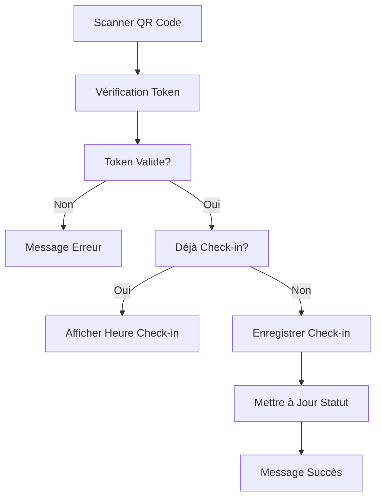

# 🎯 Guide d'Administration Complet

> **Tutoriel détaillé pour gérer des événements payants avec le système de billetterie**

## 📋 Table des Matières

1. [Création d'un événement payant](#️-création-dun-événement-payant)
2. [Configuration des tickets](#️-configuration-des-tickets)
3. [Design des tickets](#️-design-des-tickets)
4. [Gestion des participants](#️-gestion-des-participants)
5. [Configuration des emails](#️-configuration-des-emails)
6. [Gestion des check-ins](#️-gestion-des-check-ins)
7. [Rapports et analytics](#️-rapports-et-analytics)

## 🎪 Création d'un Événement Payant

### Étape 1: Accéder à l'administration

1. Se connecter à l'application : `https://votredomaine.com/login`
2. Accéder au dashboard admin : `/admin/evenements`
3. Cliquer sur "Créer un événement"

### Étape 2: Informations de base

Remplir le formulaire avec les informations essentielles :

| Champ | Description | Exemple |
|-------|-------------|---------|
| **Nom de l'événement** | Titre public de l'événement | "Conférence Tech 2024" |
| **Description** | Description détaillée | "La conférence annuelle sur les nouvelles technologies" |
| **Lieu** | Adresse ou lieu de l'événement | "Palais des Congrès, Paris" |
| **Date de début** | Date et heure de début | "2024-06-15T09:00:00Z" |
| **Date de fin** | Date et heure de fin | "2024-06-15T18:00:00Z" |
| **Capacité** | Nombre maximum de participants | 500 |
| **Événement payant** | ☑️ **COCHER CETTE CASE** | Active la billetterie |

### Étape 3: Activation de la billetterie

**Important** : Cocher la case **"Événement payant"** pour activer :
- L'onglet "Billetterie" dans la gestion de l'événement
- La configuration des types de tickets
- L'intégration Stripe pour les paiements
- Les templates de tickets personnalisés

### Étape 4: Publication

1. **Brouillon** : Enregistrer sans publier
2. **Publié** : Rendre l'événement public et accessible
3. **Archivé** : Masquer l'événement (conservation des données)

## 🎟️ Configuration des Tickets

### Accès à la billetterie

Une fois l'événement créé et publié :

1. Aller dans l'événement : `/admin/evenements/[id]`
2. Cliquer sur l'onglet **"Billetterie"**
3. La page affiche les types de tickets configurés

### Création des types de tickets

#### 1. Ticket Early Bird

```typescript
// Formulaire de création
{
  nom: "Early Bird",
  description: "Tarif spécial réservé aux 50 premières inscriptions",
  prix: 49.99,
  type_tarif: "early",
  date_debut_vente: "2024-01-01",
  date_fin_vente: "2024-03-31",
  quota_total: 50,
  visible: true
}
```

#### 2. Ticket Standard

```typescript
{
  nom: "Standard",
  description: "Accès complet à la conférence",
  prix: 79.99,
  type_tarif: "regular",
  date_debut_vente: "2024-04-01",
  date_fin_vente: "2024-06-14",
  quota_total: 300,
  visible: true
}
```

#### 3. Ticket VIP

```typescript
{
  nom: "VIP",
  description: "Accès VIP + déjeuner + cocktail networking",
  prix: 149.99,
  type_tarif: "vip",
  date_debut_vente: "2024-01-01",
  date_fin_vente: "2024-06-14",
  quota_total: 50,
  visible: true
}
```

### Paramètres avancés

| Paramètre | Description | Valeur recommandée |
|-----------|-------------|-------------------|
| **quota_total** | Limite de tickets | Nombre limité pour créer de l'urgence |
| **date_fin_vente** | Fin des ventes | 1 jour avant l'événement |
| **type_tarif** | Catégorie de tarif | early/regular/late/vip |
| **visible** | Visibilité publique | true (false pour caché) |

### Gestion des stocks

Le système suit automatiquement :
- **billets_vendus** : Incrémenté à chaque vente
- **stock_restant** : `quota_total - billets_vendus`
- **statut** : Disponible / Bientôt épuisé / Épuisé

## 🎨 Design des Tickets

### Accès aux templates

1. Dans l'événement, cliquer sur l'onglet **"Tickets"**
2. Choisir **"Créer un template"**
3. Sélectionner le type de template

### Types de templates disponibles

| Type | Usage | Orientation | Taille |
|------|-------|-------------|--------|
| **A4** | Impression professionnelle | Portrait/Paysage | 210x297mm |
| **Thermique** | Tickets sur papier thermique | Portrait | 80mm |
| **Mobile** | Affichage sur smartphone | Portrait | 375x812px |

### Configuration visuelle

#### 1. Choisir un template de base

```typescript
// Templates prédéfinis
- Classique : Fond blanc avec logo
- Moderne : Dégradé de couleurs
- Élégant : Design minimaliste
- Festival : Couleurs vives
```

#### 2. Personnaliser les zones

Le ticket est divisé en zones modulables :

| Zone | Contenu | Options |
|------|---------|---------|
| **Header** | Logo + titre | Position, taille, alignement |
| **Infos événement** | Nom, date, lieu | Police, couleurs |
| **Infos participant** | Nom, email | Mise en forme |
| **QR Code** | Code de validation | Taille, position |
| **Footer** | Conditions, contact | Texte personnalisé |

#### 3. Variables disponibles

```mustache
{{event_name}} - Nom de l'événement
{{event_date}} - Date formatée
{{event_location}} - Lieu de l'événement
{{participant_firstname}} - Prénom du participant
{{participant_lastname}} - Nom du participant
{{participant_email}} - Email du participant
{{qr_code}} - Image du code QR
{{ticket_url}} - URL du ticket en ligne
{{order_number}} - Numéro de commande
{{ticket_type}} - Type de ticket acheté
{{registration_date}} - Date d'inscription
```

### Exemple de configuration

```typescript
// Template A4 Portrait
{
  template_type: "a4",
  orientation: "portrait",
  zones: [
    {
      type: "logo",
      x: 20,
      y: 20,
      width: 100,
      height: 50,
      url: "https://example.com/logo.png"
    },
    {
      type: "text",
      x: 20,
      y: 80,
      content: "{{event_name}}",
      fontSize: 24,
      fontWeight: "bold",
      color: "#1f2937"
    },
    {
      type: "qr",
      x: 400,
      y: 100,
      size: 120,
      content: "{{ticket_url}}"
    },
    {
      type: "text",
      x: 20,
      y: 150,
      content: "Participant: {{participant_firstname}} {{participant_lastname}}",
      fontSize: 16
    }
  ]
}
```

## 👥 Gestion des Participants

### Vue d'ensemble

Accéder à la gestion des participants : `/admin/evenements/[id]/participants`

### Fonctionnalités disponibles

#### 1. Liste des participants

- **Filtres** : Par statut (check-in/non check-in), type de ticket, date
- **Recherche** : Par nom, email, numéro de téléphone
- **Tri** : Par date d'inscription, nom alphabétique
- **Export** : Excel/CSV de tous les participants

#### 2. Ajout manuel

```typescript
// Formulaire d'ajout manuel
{
  nom: "Dupont",
  prenom: "Jean",
  email: "jean.dupont@email.com",
  telephone: "0612345678",
  ticket_type_id: "uuid-ticket-vip",
  notes: "Invité spécial"
}
```

#### 3. Import CSV

Format CSV attendu :

```csv
nom,prenom,email,telephone,profession,ticket_type
Dupont,Jean,jean@email.com,0612345678,Développeur,VIP
Martin,Sophie,sophie@email.com,0623456789,Designer,Standard
```

#### 4. Gestion des statuts

| Statut | Description | Action |
|--------|-------------|--------|
| **Inscrit** | Participant enregistré | Peut être check-in |
| **Check-in** | Présence confirmée | Scan QR code |
| **Annulé** | Annulation/remboursement | Supprimer ticket |
| **En attente** | Paiement en cours | Pas de ticket envoyé |

### Actions batch

- **Envoyer tickets** : Renouveler l'envoi des tickets
- **Générer QR codes** : Recréer les tokens QR
- **Exporter** : Excel avec filtres appliqués
- **Supprimer** : Suppression en masse (attention)

## 📧 Configuration des Emails

### Templates email disponibles

#### 1. Email de confirmation d'inscription

```mustache
Sujet: Votre inscription à {{event_name}}

Bonjour {{participant_firstname}} {{participant_lastname}},

Merci pour votre inscription à {{event_name}} !

Voici les détails de votre événement :
📅 Date : {{event_date}}
📍 Lieu : {{event_location}}
🎫 Type : {{ticket_type}}

Votre billet vous sera envoyé dès la validation du paiement.

Accès à votre espace personnel : {{landing_url}}
```

#### 2. Email d'envoi du ticket

```mustache
Sujet: 🎫 Votre billet pour {{event_name}}

Bonjour {{participant_firstname}},

Votre billet est prêt !

Veuillez présenter ce billet (format papier ou mobile) à l'entrée.

[QR CODE]

Accès à votre billet en ligne : {{ticket_url}}

Important :
- Présentez-vous 15 minutes avant
- Gardez votre billet accessible
- En cas de problème : contact@votredomaine.com
```

### Configuration des services

#### 1. Brevo (Sendinblue)

1. **Créer les templates** dans l'interface Brevo
2. **Récupérer les IDs** des templates
3. **Configurer dans l'admin** :

```typescript
// Configuration dans la base de données
INSERT INTO inscription_email_templates (
  evenement_id,
  subject: "Votre billet pour {{event_name}}",
  html_content: "...", // Template HTML
  template_id_brevo: 123
);
```

#### 2. MailerSend

Même processus que Brevo mais avec l'API MailerSend

### Personnalisation avancée

#### Variables conditionnelles

```mustache
{{#if ticket_type_eq_vip}}
🌟 Accès VIP :
- Déjeuner inclus
- Lounge dédié
- Session de meet & greet
{{/if}}

{{#if has_sessions}}
📋 Vos sessions :
{{sessions_list}}
{{/if}}
```

#### Pièces jointes

- **PDF du ticket** : Généré automatiquement
- **Programme** : PDF optionnel
- **Plan d'accès** : Image ou PDF

## 🔍 Gestion des Check-ins

### Système de scan

#### 1. Interfaces de scan disponibles

| Interface | Usage | Accès |
|-----------|-------|-------|
| **Scanner Web** | Scan avec caméra PC | `/scanner` |
| **Scanner Mobile** | Interface optimisée mobile | `/qr-scanner` |
| **App Scanner** | Application dédiée | URL directe |

#### 2. Processus de check-in



#### 3. États de check-in

| État | Message | Action |
|------|---------|--------|
| ✅ **Succès** | "Check-in réussi à 14h30" | Afficher participant |
| ⚠️ **Déjà fait** | "Déjà check-in à 09h15" | Afficher détails |
| ❌ **Invalide** | "Ticket non trouvé ou expiré" | Refuser entrée |
| 🔒 **Session** | "Non inscrit à cette session" | Vérifier inscription |

### Configuration des sessions

Pour les événements multi-sessions :

1. **Créer les sessions** : `/admin/evenements/[id]/sessions`
2. **Associer les participants** : Manuelle ou automatique
3. **Check-in par session** : Scan spécifique à chaque session

### Rapports de check-in

Export des données de présence :

```typescript
// Format export CSV
participant_id,nom,prenom,email,checkin_time,checked_by,session
123,Dupont,Jean,jean@email.com,2024-06-15T09:15:00Z,Alice,Keynote
124,Martin,Sophie,sophie@email.com,2024-06-15T09:20:00Z,Bob,Keynote
```

## 📊 Rapports et Analytics

### Tableaux de bord

#### 1. Vue d'ensemble de l'événement

```typescript
// Métriques principales
{
  total_inscriptions: 245,
  total_revenue: 18543.50,
  checkins_count: 198,
  checkin_rate: 80.8, // %
  tickets_sold_by_type: {
    "Early Bird": 50,
    "Standard": 150,
    "VIP": 45
  }
}
```

#### 2. Graphiques disponibles

- **Évolution des inscriptions** : Courbe temporelle
- **Répartition des tickets** : Camembert par type
- **Taux de check-in** : Barres par session
- **Revenue par jour** : Histogramme

#### 3. Filtres temporels

- **Aujourd'hui** : Inscriptions du jour
- **Cette semaine** : 7 derniers jours
- **Ce mois** : Mois en cours
- **Personnalisé** : Plage de dates

### Exports

#### 1. Export Excel complet

```typescript
// Colonnes incluses
[
  "ID Participant",
  "Nom",
  "Prénom",
  "Email",
  "Téléphone",
  "Type de ticket",
  "Prix payé",
  "Date d'inscription",
  "Check-in",
  "Heure de check-in",
  "Token QR",
  "URL ticket"
]
```

#### 2. Export des paiements

```typescript
// Détails financiers
[
  "Numéro de commande",
  "Date",
  "Client",
  "Montant total",
  "Statut paiement",
  "Moyen de paiement",
  "ID Stripe"
]
```

#### 3. Export des check-ins

```typescript
// Données de présence
[
  "Participant",
  "Session",
  "Heure de check-in",
  "Opérateur",
  "Notes",
  "Device info"
]
```

## 🚀 Bonnes Pratiques

### Avant l'événement

1. **Tester tous les tickets** : Générer et vérifier chaque type
2. **Tester les emails** : Envoyer des emails de test
3. **Vérifier les QR codes** : Tester avec différents scanners
4. **Préparer les équipes** : Former les staff au check-in

### Pendant l'événement

1. **Surveiller les check-ins** : Tableau de bord en temps réel
2. **Gérer les problèmes** : Accès rapide aux participant data
3. **Communication** : Messages d'alerte si besoin

### Après l'événement

1. **Exporter les données** : Rapports complets
2. **Analyser les performances** : KPIs et ROI
3. **Envoyer les follow-ups** : Emails post-événement
4. **Archiver** : Nettoyer et sauvegarder

---

**Prochaine étape** : [Documentation API](04-api-endpoints.md) →