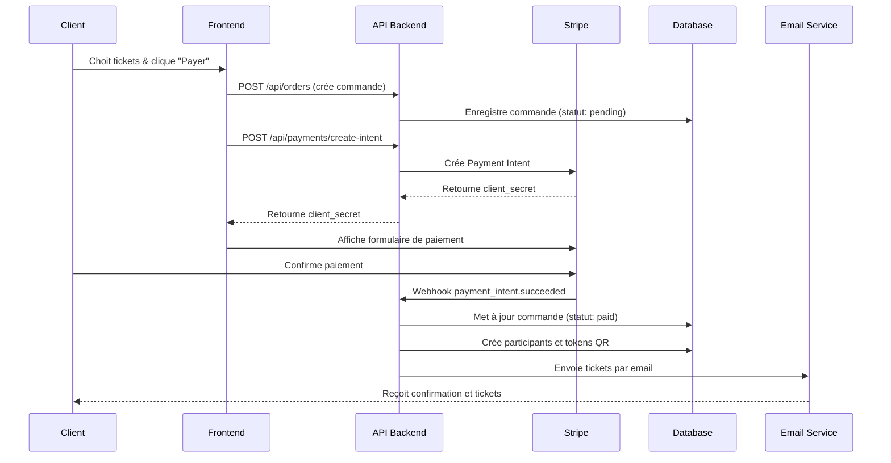

# 💳 Configuration Stripe Complète

> **Guide détaillé pour intégrer Stripe dans le système de billetterie**

## 📋 Table des Matières

1. [Prérequis Stripe](#️-prérequis-stripe)
2. [Configuration du compte](#️-configuration-du-compte)
3. [Clés API et webhooks](#️-clés-api-et-webhooks)
4. [Integration client](#️-integration-client)
5. [Webhooks et backends](#️-webhooks-et-backends)
6. [Gestion des paiements](#️-gestion-des-paiements)
7. [Sécurité et conformité](#️-sécurité-et-conformité)
8. [Monitoring et debugging](#️-monitoring-et-debugging)

## 🎯 Prérequis Stripe

### 1. Création du compte

1. **Inscription** : [stripe.com](https://stripe.com)
2. **Vérification du compte** :
   - Email professionnel
   - Informations bancaires
   - Documents d'identité (si requis)
3. **Activation des fonctionnalités** :
   - ✅ Payments
   - ✅ Checkout
   - ✅ Webhooks
   - ✅ Radar (fraude detection)

### 2. Configuration de base

```bash
# Compte de test (automatique)
# Clés de test commencent par pk_test_ et sk_test_

# Compte de production (à activer)
# Clés de production commencent par pk_live_ et sk_live_
```

## ⚙️ Configuration du Compte

### 1. Paramètres du compte

Aller dans **Settings > Account details** :

| Paramètre | Valeur recommandée | Description |
|-----------|-------------------|-------------|
| **Business name** | Nom de votre organisation | Affiché sur les relevés |
| **Business website** | https://votredomaine.com | Vérifié par Stripe |
| **Customer support email** | support@votredomaine.com | Pour les litiges |
| **Business type** | Company/Individual | Selon votre statut |
| **Country** | France/UE | Important pour la devise |

### 2. Configuration des paiements

**Settings > Payments** :

```typescript
// Configuration recommandée
{
  payment_methods: [
    "card",           // Cartes bancaires
    "sepa_debit",     // Virement SEPA (UE)
    "ideal",          // Pays-Bas
    "bancontact",     // Belgique
    "giropay",        // Allemagne
    "sofort"          // Allemagne/Autriche
  ],
  currency: "eur",
  statement_descriptor: "VOTRENOM-EVENTS"
}
```

### 3. Configuration de Checkout

**Settings > Checkout** :

```typescript
// Personnalisation du Checkout Session
{
  branding: {
    logo: "https://votredomaine.com/logo.png",
    primary_color: "#3B82F6",
    icon: "auto"
  },
  customer_creation: "always",    // Créer un client Stripe
  billing_address_collection: "required",
  shipping_address_collection: "never",
  allow_promotion_codes: true,
  success_url: "https://votredomaine.com/success?session_id={CHECKOUT_SESSION_ID}",
  cancel_url: "https://votredomaine.com/cancel"
}
```

## 🔑 Clés API et Webhooks

### 1. Clés API

**Developers > API keys** :

```env
# Clés de test (développement)
STRIPE_PUBLISHABLE_KEY_TEST=pk_test_51xxxxxxxxxxxxxxxxxxxx
STRIPE_SECRET_KEY_TEST=sk_test_51xxxxxxxxxxxxxxxxxxxx

# Clés de production (déploiement)
STRIPE_PUBLISHABLE_KEY=pk_live_51xxxxxxxxxxxxxxxxxxxx
STRIPE_SECRET_KEY=sk_live_51xxxxxxxxxxxxxxxxxxxx

# Webhook secret (voir ci-dessous)
STRIPE_WEBHOOK_SECRET=whsec_xxxxxxxxxxxxxxxxxxxxxx
```

### 2. Configuration des Webhooks

**Developers > Webhooks** :

#### Ajouter un endpoint

1. **URL du webhook** : `https://votredomaine.com/api/payments/stripe`
2. **Événements à écouter** :
   ```json
   {
     "events": [
       "payment_intent.succeeded",
       "payment_intent.payment_failed",
       "payment_intent.canceled",
       "checkout.session.completed",
       "charge.succeeded",
       "charge.failed",
       "invoice.payment_succeeded",
       "invoice.payment_failed"
     ]
   }
   ```

3. **Signature du webhook** :
   - Copier le **signing secret**
   - Ajouter à `STRIPE_WEBHOOK_SECRET`

#### Structure du webhook handler

```typescript
// src/app/api/payments/stripe/route.ts
import { headers } from 'next/headers';
import { NextResponse } from 'next/server';
import Stripe from 'stripe';
import { updateOrderStatus } from '@/lib/orders';
import { sendTicketEmail } from '@/lib/email';

const stripe = new Stripe(process.env.STRIPE_SECRET_KEY!, {
  apiVersion: '2023-10-16',
});

const webhookSecret = process.env.STRIPE_WEBHOOK_SECRET!;

export async function POST(req: Request) {
  const body = await req.text();
  const sig = headers().get('stripe-signature')!;

  let event: Stripe.Event;

  try {
    event = stripe.webhooks.constructEvent(body, sig, webhookSecret);
  } catch (err) {
    console.error('Webhook signature verification failed:', err);
    return NextResponse.json({ error: 'Invalid signature' }, { status: 400 });
  }

  switch (event.type) {
    case 'payment_intent.succeeded':
      const paymentIntent = event.data.object as Stripe.PaymentIntent;
      await handlePaymentSuccess(paymentIntent);
      break;

    case 'payment_intent.payment_failed':
      const failedPayment = event.data.object as Stripe.PaymentIntent;
      await handlePaymentFailure(failedPayment);
      break;

    case 'checkout.session.completed':
      const session = event.data.object as Stripe.Checkout.Session;
      await handleCheckoutCompleted(session);
      break;

    default:
      console.log(`Unhandled event type ${event.type}`);
  }

  return NextResponse.json({ received: true });
}

async function handlePaymentSuccess(paymentIntent: Stripe.PaymentIntent) {
  const orderId = paymentIntent.metadata.orderId;

  // Mettre à jour le statut de la commande
  await updateOrderStatus(orderId, 'paid');

  // Créer les participants
  await createParticipantsForOrder(orderId);

  // Envoyer les tickets
  await sendTicketsForOrder(orderId);
}
```

## 💻 Integration Client

### 1. Installation des dépendances

```bash
npm install @stripe/react-stripe-js @stripe/stripe-js
```

### 2. Configuration du provider Stripe

```typescript
// src/components/providers/StripeProvider.tsx
'use client';

import { loadStripe } from '@stripe/stripe-js';
import { Elements } from '@stripe/react-stripe-js';

const stripePromise = loadStripe(
  process.env.NEXT_PUBLIC_STRIPE_PUBLISHABLE_KEY!
);

export function StripeProvider({ children }: { children: React.ReactNode }) {
  return (
    <Elements stripe={stripePromise}>
      {children}
    </Elements>
  );
}
```

### 3. Formulaire de paiement

```typescript
// src/components/payments/PaymentForm.tsx
'use client';

import { useState } from 'react';
import { loadStripe } from '@stripe/stripe-js';
import {
  PaymentElement,
  Elements,
  useStripe,
  useElements,
} from '@stripe/react-stripe-js';

interface PaymentFormProps {
  clientSecret: string;
  orderId: string;
  onSuccess: () => void;
  onError: (error: string) => void;
}

function PaymentFormContent({ clientSecret, onSuccess, onError }: PaymentFormProps) {
  const stripe = useStripe();
  const elements = useElements();
  const [isLoading, setIsLoading] = useState(false);

  const handleSubmit = async (e: React.FormEvent) => {
    e.preventDefault();

    if (!stripe || !elements) {
      return;
    }

    setIsLoading(true);

    const { error } = await stripe.confirmPayment({
      elements,
      confirmParams: {
        return_url: `${window.location.origin}/payment/success`,
      },
    });

    if (error) {
      onError(error.message || 'Une erreur est survenue');
    } else {
      onSuccess();
    }

    setIsLoading(false);
  };

  return (
    <form onSubmit={handleSubmit} className="space-y-4">
      <PaymentElement />
      <button
        type="submit"
        disabled={isLoading || !stripe || !elements}
        className="w-full bg-blue-600 text-white py-3 px-4 rounded-lg disabled:opacity-50"
      >
        {isLoading ? 'Traitement en cours...' : 'Payer'}
      </button>
    </form>
  );
}

export function PaymentForm(props: PaymentFormProps) {
  return (
    <Elements stripe={stripePromise} options={{ clientSecret: props.clientSecret }}>
      <PaymentFormContent {...props} />
    </Elements>
  );
}
```

### 4. Création du Payment Intent

```typescript
// src/app/api/payments/create-intent/route.ts
import { NextResponse } from 'next/server';
import Stripe from 'stripe';

const stripe = new Stripe(process.env.STRIPE_SECRET_KEY!, {
  apiVersion: '2023-10-16',
});

export async function POST(req: Request) {
  try {
    const { amount, orderId, metadata } = await req.json();

    // Créer le Payment Intent
    const paymentIntent = await stripe.paymentIntents.create({
      amount: Math.round(amount * 100), // Convertir en centimes
      currency: 'eur',
      metadata: {
        orderId,
        ...metadata
      },
      automatic_payment_methods: {
        enabled: true,
      },
    });

    return NextResponse.json({
      clientSecret: paymentIntent.client_secret,
      paymentIntentId: paymentIntent.id,
    });
  } catch (error) {
    console.error('Error creating payment intent:', error);
    return NextResponse.json(
      { error: 'Failed to create payment intent' },
      { status: 500 }
    );
  }
}
```

## 🔄 Gestion des Paiements

### 1. Flux de paiement complet



### 2. Gestion des erreurs de paiement

```typescript
// src/lib/payments/error-handling.ts
export class PaymentError extends Error {
  constructor(
    message: string,
    public code: string,
    public type: 'card_error' | 'validation_error' | 'api_error'
  ) {
    super(message);
    this.name = 'PaymentError';
  }
}

export const handlePaymentError = (error: any): PaymentError => {
  if (error.type === 'card_error') {
    switch (error.code) {
      case 'card_declined':
        return new PaymentError(
          'Votre carte a été refusée',
          'CARD_DECLINED',
          'card_error'
        );
      case 'insufficient_funds':
        return new PaymentError(
          'Fonds insuffisants sur votre carte',
          'INSUFFICIENT_FUNDS',
          'card_error'
        );
      case 'incorrect_cvc':
        return new PaymentError(
          'Code CVC incorrect',
          'INCORRECT_CVC',
          'card_error'
        );
      default:
        return new PaymentError(
          error.message || 'Erreur de paiement',
          error.code,
          'card_error'
        );
    }
  }

  return new PaymentError(
    'Une erreur est survenue lors du paiement',
    'PAYMENT_ERROR',
    'api_error'
  );
};
```

### 3. Remboursements

```typescript
// src/app/api/payments/refund/route.ts
export async function POST(req: Request) {
  try {
    const { paymentIntentId, amount, reason } = await req.json();

    const refund = await stripe.refunds.create({
      payment_intent: paymentIntentId,
      amount: amount ? Math.round(amount * 100) : undefined, // undefined = remboursement total
      reason: reason || 'requested_by_customer',
    });

    // Mettre à jour le statut de la commande
    await updateOrderStatusByPaymentIntent(paymentIntentId, 'refunded');

    return NextResponse.json({
      success: true,
      refundId: refund.id,
      amount: refund.amount / 100,
      status: refund.status,
    });
  } catch (error) {
    return NextResponse.json(
      { error: 'Failed to process refund' },
      { status: 500 }
    );
  }
}
```

## 🔒 Sécurité et Conformité

### 1. PCI DSS Compliance

Le système est PCI DSS compliant car :

- ✅ **Pas de stockage de données de carte** sur nos serveurs
- ✅ **Utilisation de Stripe Elements** pour les formulaires
- ✅ **Communication HTTPS** obligatoire
- ✅ **Clés API sécurisées** côté serveur uniquement

### 2. Validation et sécurité

```typescript
// src/lib/payments/security.ts
export const validatePaymentAmount = (amount: number, ticketTypes: any[]) => {
  // Vérifier que le montant correspond aux tickets sélectionnés
  const expectedAmount = ticketTypes.reduce((total, ticket) => {
    return total + (ticket.prix * ticket.quantite);
  }, 0);

  if (Math.abs(amount - expectedAmount) > 0.01) {
    throw new Error('Montant invalide');
  }
};

export const verifyWebhookSignature = (payload: string, signature: string, secret: string) => {
  try {
    return stripe.webhooks.constructEvent(payload, signature, secret);
  } catch (error) {
    console.error('Webhook signature verification failed:', error);
    throw new Error('Invalid webhook signature');
  }
};
```

### 3. Gestion des données sensibles

```typescript
// Configuration CORS sécurisée
export const corsConfig = {
  origin: ['https://votredomaine.com', 'https://admin.votredomaine.com'],
  methods: ['GET', 'POST', 'PUT', 'DELETE'],
  allowedHeaders: ['Content-Type', 'Authorization'],
  credentials: true,
};

// Rate limiting pour les endpoints de paiement
export const paymentRateLimit = {
  windowMs: 15 * 60 * 1000, // 15 minutes
  max: 10, // maximum 10 tentatives de paiement par IP
  message: 'Trop de tentatives de paiement, veuillez réessayer plus tard',
};
```

## 📊 Monitoring et Debugging

### 1. Logs des transactions

```typescript
// src/lib/payments/logging.ts
export const logPaymentEvent = async (event: Stripe.Event) => {
  const logData = {
    eventId: event.id,
    type: event.type,
    created: new Date(event.created * 1000),
    data: {
      paymentIntentId: event.data.object.id,
      amount: event.data.object.amount,
      currency: event.data.object.currency,
      status: event.data.object.status,
      metadata: event.data.object.metadata,
    },
  };

  // Logger dans la base de données
  await supabase
    .from('payment_logs')
    .insert(logData);

  // Logger dans console (production)
  console.log('Payment Event:', JSON.stringify(logData, null, 2));
};
```

### 2. Dashboard de monitoring

```typescript
// src/app/admin/payments/dashboard/page.tsx
export default async function PaymentsDashboard() {
  // Statistiques des 30 derniers jours
  const stats = await getPaymentStats();

  return (
    <div className="space-y-6">
      <div className="grid grid-cols-1 md:grid-cols-4 gap-4">
        <MetricCard
          title="Revenu total"
          value={formatCurrency(stats.totalRevenue)}
          change={stats.revenueChange}
        />
        <MetricCard
          title="Transactions réussies"
          value={stats.successfulTransactions}
          change={stats.transactionsChange}
        />
        <MetricCard
          title="Taux de conversion"
          value={`${stats.conversionRate}%`}
          change={stats.conversionChange}
        />
        <MetricCard
          title="Panier moyen"
          value={formatCurrency(stats.averageOrderValue)}
          change={stats.aovChange}
        />
      </div>

      {/* Transactions récentes */}
      <RecentTransactions />

      {/* Graphiques */}
      <PaymentCharts data={stats.chartData} />
    </div>
  );
}
```

### 3. Tests et validation

```typescript
// scripts/test-stripe-integration.ts
export const testStripeIntegration = async () => {
  console.log('🧪 Testing Stripe Integration...');

  try {
    // 1. Test création Payment Intent
    const paymentIntent = await stripe.paymentIntents.create({
      amount: 1000, // 10€
      currency: 'eur',
      payment_method: 'pm_card_visa',
      confirm: true,
    });

    console.log('✅ Payment Intent created:', paymentIntent.id);

    // 2. Test webhook
    const testEvent = {
      type: 'payment_intent.succeeded',
      data: { object: paymentIntent },
    };

    console.log('✅ Webhook test data created');

    // 3. Test remboursement
    const refund = await stripe.refunds.create({
      payment_intent: paymentIntent.id,
    });

    console.log('✅ Refund processed:', refund.id);

    return { success: true, paymentIntentId: paymentIntent.id };
  } catch (error) {
    console.error('❌ Stripe test failed:', error);
    return { success: false, error: error.message };
  }
};
```

## 🚀 Déploiement en Production

### 1. Checklist avant déploiement

- [ ] **Basculer vers les clés live** de Stripe
- [ ] **Configurer le webhook en production**
- [ ] **Tester le flux de paiement complet**
- [ ] **Vérifier les emails de confirmation**
- [ ] **Configurer le monitoring**
- [ ] **Activer les alertes Stripe**

### 2. Variables d'environnement production

```env
# Production
NEXT_PUBLIC_STRIPE_PUBLISHABLE_KEY=pk_live_51xxxxxxxxxxxxxxxxxxxx
STRIPE_SECRET_KEY=sk_live_51xxxxxxxxxxxxxxxxxxxx
STRIPE_WEBHOOK_SECRET=whsec_xxxxxxxxxxxxxxxxxxxxxx

# URLs de production
NEXT_PUBLIC_APP_URL=https://votredomaine.com
STRIPE_SUCCESS_URL=https://votredomaine.com/payment/success
STRIPE_CANCEL_URL=https://votredomaine.com/payment/cancel
```

### 3. Monitoring post-déploiement

```typescript
// health check pour Stripe
export const checkStripeHealth = async () => {
  try {
    // Test simple : récupérer le balance
    const balance = await stripe.balance.retrieve();
    return {
      status: 'healthy',
      available: balance.available[0].amount,
      currency: balance.available[0].currency,
    };
  } catch (error) {
    return {
      status: 'unhealthy',
      error: error.message,
    };
  }
};
```

---

**Prochaine étape** : [Guide de dépannage](06-troubleshooting.md) →