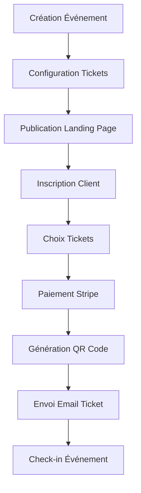

# 🎫 Système Complet de Gestion des Tickets - Documentation Complète

> **Plateforme de gestion d'événements avec billetterie intégrée, QR codes, et système de check-in automatisé**

## 📋 Table des Matières

1. [Vue d'ensemble](#-vue-densemble)
2. [Architecture technique](#-architecture-technique)
3. [Configuration système](#-configuration-système)
4. [Guide d'administration](#-guide-dadministration)
5. [API Endpoints](#-api-endpoints)
6. [Configuration Stripe](#-configuration-stripe)
7. [Dépannage](#-dépannage)

## 🎯 Vue d'ensemble

### Fonctionnalités principales

- 🎟️ **Billetterie multi-tarifs** : Early Bird, Standard, VIP
- 💳 **Paiement sécurisé** : Integration Stripe complète
- 📱 **Tickets digitaux** : QR codes uniques et PDF personnalisables
- 📧 **Envoi automatique** : Emails de confirmation avec tickets
- 🔍 **Check-in scan** : Scanner QR codes multi-supports
- 📊 **Analytics** : Suivi des ventes et des présences
- 🎨 **Templates personnalisés** : Design de tickets sur mesure

### Flux utilisateur complet



## 📁 Structure des Fichiers

Ce dossier contient toute la documentation du système de ticket :

```
tutorial/
├── README.md                 # Vue d'ensemble (ce fichier)
├── 01-system-setup.md       # Configuration système complète
├── 02-architecture.md        # Architecture technique détaillée
├── 03-admin-guide.md         # Guide d'administration
├── 04-api-endpoints.md       # Documentation API complète
├── 05-stripe-setup.md        # Configuration Stripe détaillée
└── 06-troubleshooting.md     # Guide de dépannage
```

## 🚀 Démarrage Rapide

### 1. Prérequis

- Node.js 18+
- Compte Stripe activé
- Base de données Supabase configurée
- Compte email (Brevo ou MailerSend)

### 2. Installation

```bash
# Cloner le projet
git clone <repository-url>
cd NEXJS-INSCRIPTIONS

# Installer les dépendances
cd event-admin
npm install

# Configurer les variables d'environnement
cp .env.example .env.local
```

### 3. Configuration essentielle

Variables d'environnement requises :

```env
# Supabase
NEXT_PUBLIC_SUPABASE_URL=your_supabase_url
NEXT_PUBLIC_SUPABASE_ANON_KEY=your_supabase_anon_key

# Stripe
STRIPE_SECRET_KEY=sk_live_...
STRIPE_PUBLISHABLE_KEY=pk_live_...
STRIPE_WEBHOOK_SECRET=whsec_...

# Email
BREVO_API_KEY=your_brevo_key
# ou
MAILERSEND_API_KEY=your_mailersend_key

# Upload
UPLOADTHING_SECRET=your_uploadthing_secret
UPLOADTHING_APP_ID=your_uploadthing_app_id
```

### 4. Lancement

```bash
# Développement
npm run dev

# Production
npm run build
npm run start
```

## 📞 Support

Pour toute question ou problème :

1. Consulter le [guide de dépannage](06-troubleshooting.md)
2. Vérifier la [documentation API](04-api-endpoints.md)
3. Contacter l'administrateur système

---

**Version** : 1.0.0
**Dernière mise à jour** : 2024-01-01
**Auteur** : Système de Gestion des Tickets